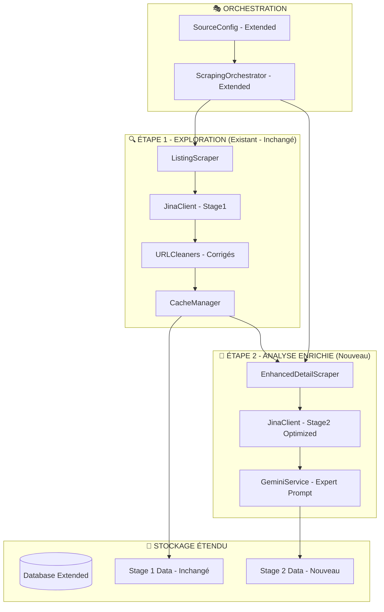

# Design Document - Phase 2: Enhanced Data Pipeline

## Overview

Ce document décrit l'architecture technique pour l'implémentation de la Phase 2 du projet jinascraper. L'objectif est d'enrichir le pipeline existant avec des capacités d'extraction Markdown + structuration JSON avancée, tout en préservant la compatibilité et la stabilité du système actuel.

## Architecture System Overview



## Detailed Component Design

### 1. Configuration Extension (Minimal Impact)

#### 1.1 Base Configuration Extension

```python
# Modification MINIMALE de config/base_config.py
@dataclass
class SourceBaseConfig:
    # ... TOUS les champs existants INCHANGÉS ...
    
    # NOUVEAU : Configuration optionnelle Stage 2
    stage2_params: Optional[Dict[str, Any]] = None
    
    def get_stage2_jina_params(self) -> Dict[str, Any]:
        """Retourne les paramètres Jina optimisés pour Stage 2."""
        if not self.stage2_params:
            # Fallback intelligent basé sur la config existante
            return {
                "css_selector_excluding": self.css_selector_exclude or "header, footer, .ads, .sidebar",
                "use_reader_lm_v2": "true" if self.use_reader_lm else "false",
                "timeout": "45",
                "with_generated_alt": "true"
            }
        
        # Merge des paramètres par défaut avec les paramètres spécifiques
        default_params = {
            "timeout": "45",
            "with_generated_alt": "true",
            "use_reader_lm_v2": "true"
        }
        
        stage2_jina = self.stage2_params.get("jina_params", {})
        return {**default_params, **stage2_jina}
    
    def get_stage2_gemini_config(self) -> Dict[str, Any]:
        """Retourne la configuration Gemini pour Stage 2."""
        if not self.stage2_params:
            return {
                "model": "gemini-1.5-flash",
                "temperature": 0.1,
                "max_tokens": 2048
            }
        
        return self.stage2_params.get("gemini_config", {
            "model": "gemini-1.5-flash",
            "temperature": 0.1,
            "max_tokens": 2048
        })
```

#### 1.2 Source Configuration Examples

```python
# Exemple dans config/sources/emploi_tg.py
EMPLOI_TG_CONFIG = SourceBaseConfig(
    # ... toute la configuration existante INCHANGÉE ...
    
    # NOUVEAU : Configuration Stage 2 optionnelle
    stage2_params={
        "jina_params": {
            "css_selector_only": "div.job-description, .job-content, .offre-details, main",
            "css_selector_excluding": "header, footer, .ads, .sidebar, .social-share, .navigation, .breadcrumb",
            "use_reader_lm_v2": "true",
            "timeout": "60",
            "with_generated_alt": "true"
        },
        "gemini_config": {
            "model": "gemini-1.5-flash",
            "temperature": 0.1,
            "max_tokens": 2048
        },
        "enabled": True  # Permet d'activer/désactiver Stage 2 par source
    }
)
```

### 2. Database Schema Extension (Safe Migration)

#### 2.1 Migration Script

```sql
-- Migration Phase 2.1 : Colonnes optionnelles (NULL par défaut)
-- Cette migration est INSTANTANÉE et SÛRE

-- Ajout des colonnes pour les données enrichies
ALTER TABLE jobs ADD COLUMN IF NOT EXISTS stage2_markdown TEXT NULL;
ALTER TABLE jobs ADD COLUMN IF NOT EXISTS stage2_structured JSONB NULL;
ALTER TABLE jobs ADD COLUMN IF NOT EXISTS processing_stage VARCHAR(20) DEFAULT 'stage1';

-- Ajout de métadonnées pour le suivi
ALTER TABLE jobs ADD COLUMN IF NOT EXISTS stage2_processed_at TIMESTAMP NULL;
ALTER TABLE jobs ADD COLUMN IF NOT EXISTS stage2_processing_time_ms INTEGER NULL;

-- Index pour les performances
CREATE INDEX IF NOT EXISTS idx_jobs_processing_stage ON jobs(processing_stage);
CREATE INDEX IF NOT EXISTS idx_jobs_stage2_structured ON jobs USING GIN(stage2_structured) WHERE stage2_structured IS NOT NULL;

-- Index partiel pour les requêtes Stage 2
CREATE INDEX IF NOT EXISTS idx_jobs_stage2_data ON jobs(id, source_url) WHERE processing_stage = 'stage2';

-- Préparation Phase 2.2 (optionnel, pour plus tard)
-- ALTER TABLE jobs ADD COLUMN IF NOT EXISTS content_chunks JSONB NULL;
-- ALTER TABLE jobs ADD COLUMN IF NOT EXISTS description_embedding vector(1024) NULL;
```

#### 2.2 Data Model Extensions

```python
# Extension des modèles dans models.py
from typing import Optional, Dict, Any
from datetime import datetime

@dataclass
class EnrichedJobData:
    """Modèle pour les données enrichies Stage 2."""
    
    # Données de base (héritées de Stage 1)
    job_id: str
    source_url: str
    
    # Données enrichies Stage 2
    stage2_markdown: str
    stage2_structured: Dict[str, Any]
    processing_stage: str = "stage2"
    
    # Métadonnées de traitement
    stage2_processed_at: datetime
    stage2_processing_time_ms: int
    
    # Qualité et validation
    extraction_quality_score: float
    validation_errors: List[str] = field(default_factory=list)

@dataclass
class Stage2StructuredData:
    """Schéma pour les données JSON structurées."""
    
    # Informations de base
    title: Optional[str] = None
    company: Optional[str] = None
    
    # Localisation
    location: Optional[Dict[str, str]] = None  # {"city": "Lomé", "region": "Maritime", "country": "Togo"}
    
    # Contrat
    contract: Optional[Dict[str, Any]] = None  # {"type": "CDI", "duration": null, "start_date": "2025-02-01"}
    
    # Salaire
    salary: Optional[Dict[str, Any]] = None  # {"min": 150000, "max": 200000, "currency": "XOF", "period": "monthly"}
    
    # Exigences
    requirements: Optional[Dict[str, Any]] = None  # {"experience": "2-3 ans", "education": "Bac+3", "skills": [...]}
    
    # Description détaillée
    description: Optional[Dict[str, Any]] = None  # {"summary": "...", "missions": [...], "profile": "...", "benefits": [...]}
    
    # Candidature
    application: Optional[Dict[str, Any]] = None  # {"deadline": "2025-03-01", "email": "...", "phone": "...", "instructions": "..."}
    
    # Métadonnées
    metadata: Optional[Dict[str, Any]] = None  # {"publication_date": "2025-01-15", "sector": "IT", "department": "Développement"}
```

### 3. Enhanced Detail Scraper Service

#### 3.1 Service Architecture

```python
# Nouveau fichier: services/enhanced_detail_scraper.py
"""Enhanced Detail Scraper for Stage 2 - Rich data extraction."""

import asyncio
import time
from typing import List, Dict, Any, Optional
import structlog
from datetime import datetime

from ..config import SourceRegistry
from ..models import EnrichedJobData, Stage2StructuredData
from .jina_client import JinaClient
from .gemini_service import GeminiService


logger = structlog.get_logger(__name__)


class EnhancedDetailScraper:
    """Service d'extraction enrichie pour Stage 2."""
    
    def __init__(
        self, 
        jina_client: Optional[JinaClient] = None,
        gemini_service: Optional[GeminiService] = None
    ):
        """
        Initialize the Enhanced Detail Scraper.
        
        Args:
            jina_client: Optional JinaClient instance
            gemini_service: Optional GeminiService instance
        """
        self.jina_client = jina_client or JinaClient()
        self.gemini_service = gemini_service or GeminiService()
    
    async def __aenter__(self):
        """Async context manager entry."""
        return self
    
    async def __aexit__(self, exc_type, exc_val, exc_tb):
        """Async context manager exit."""
        if self.jina_client:
            await self.jina_client.__aexit__(exc_type, exc_val, exc_tb)
    
    async def extract_enriched_job_data(
        self, 
        job_url: str, 
        source_name: str
    ) -> Optional[EnrichedJobData]:
        """
        Extraction enrichie Stage 2 : Markdown + JSON structuré.
        
        Args:
            job_url: URL de l'offre d'emploi
            source_name: Nom de la source (pour configuration spécialisée)
            
        Returns:
            EnrichedJobData ou None si échec
        """
        try:
            logger.info("Starting Stage 2 enriched extraction", 
                       url=job_url, source=source_name)
            
            start_time = time.time()
            
            # 1. Récupération de la configuration Stage 2
            source_config = SourceRegistry.get_source(source_name)
            if not source_config:
                logger.error("Source configuration not found", source=source_name)
                return None
            
            # Vérifier si Stage 2 est activé pour cette source
            if not self._is_stage2_enabled(source_config):
                logger.info("Stage 2 not enabled for source", source=source_name)
                return None
            
            # 2. Extraction Markdown optimisée
            stage2_markdown = await self._extract_optimized_markdown(
                job_url, source_config
            )
            
            if not stage2_markdown:
                logger.warning("Failed to extract markdown", url=job_url)
                return None
            
            # 3. Structuration JSON via Gemini Expert
            stage2_structured = await self._structure_with_gemini_expert(
                stage2_markdown, job_url, source_config
            )
            
            if not stage2_structured:
                logger.warning("Failed to structure data with Gemini", url=job_url)
                return None
            
            # 4. Calcul des métriques
            processing_time_ms = int((time.time() - start_time) * 1000)
            quality_score = self._calculate_quality_score(stage2_structured)
            
            # 5. Création de l'objet enrichi
            enriched_data = EnrichedJobData(
                job_id=self._generate_job_id(job_url),
                source_url=job_url,
                stage2_markdown=stage2_markdown,
                stage2_structured=stage2_structured,
                processing_stage="stage2",
                stage2_processed_at=datetime.utcnow(),
                stage2_processing_time_ms=processing_time_ms,
                extraction_quality_score=quality_score
            )
            
            logger.info("Stage 2 extraction completed successfully",
                       url=job_url, 
                       source=source_name,
                       processing_time_ms=processing_time_ms,
                       quality_score=quality_score,
                       markdown_length=len(stage2_markdown))
            
            return enriched_data
            
        except Exception as e:
            logger.error("Stage 2 extraction failed",
                        url=job_url,
                        source=source_name,
                        error=str(e))
            return None
    
    async def extract_multiple_enriched_jobs(
        self, 
        job_urls: List[str], 
        source_name: str,
        max_concurrent: int = 5
    ) -> List[EnrichedJobData]:
        """
        Extraction enrichie de multiple jobs avec contrôle de concurrence.
        
        Args:
            job_urls: Liste des URLs à traiter
            source_name: Nom de la source
            max_concurrent: Nombre maximum de requêtes simultanées
            
        Returns:
            Liste des données enrichies extraites avec succès
        """
        logger.info("Starting batch Stage 2 extraction",
                   source=source_name,
                   total_urls=len(job_urls),
                   max_concurrent=max_concurrent)
        
        # Traitement par batch pour contrôler la charge
        semaphore = asyncio.Semaphore(max_concurrent)
        
        async def extract_with_semaphore(url: str) -> Optional[EnrichedJobData]:
            async with semaphore:
                return await self.extract_enriched_job_data(url, source_name)
        
        # Exécution des tâches
        tasks = [extract_with_semaphore(url) for url in job_urls]
        results = await asyncio.gather(*tasks, return_exceptions=True)
        
        # Filtrage des résultats
        successful_extractions = []
        errors = 0
        
        for i, result in enumerate(results):
            if isinstance(result, Exception):
                logger.error("Batch extraction error",
                           url=job_urls[i],
                           error=str(result))
                errors += 1
            elif result is not None:
                successful_extractions.append(result)
        
        logger.info("Batch Stage 2 extraction completed",
                   source=source_name,
                   total_urls=len(job_urls),
                   successful=len(successful_extractions),
                   errors=errors,
                   success_rate=len(successful_extractions) / len(job_urls))
        
        return successful_extractions
    
    def _is_stage2_enabled(self, source_config) -> bool:
        """Vérifie si Stage 2 est activé pour cette source."""
        if not source_config.stage2_params:
            return False
        return source_config.stage2_params.get("enabled", False)
    
    async def _extract_optimized_markdown(
        self, 
        job_url: str, 
        source_config
    ) -> Optional[str]:
        """Extraction Markdown optimisée avec paramètres Stage 2."""
        try:
            # Récupération des paramètres Jina optimisés
            jina_params = source_config.get_stage2_jina_params()
            
            logger.debug("Using Stage 2 Jina parameters",
                        url=job_url,
                        params=jina_params)
            
            # Appel Jina Reader avec paramètres optimisés
            response_data = await self.jina_client.make_request(job_url, jina_params)
            content = response_data.get("content", "")
            
            if not content or len(content) < 100:
                logger.warning("Insufficient content extracted",
                             url=job_url,
                             content_length=len(content))
                return None
            
            return content
            
        except Exception as e:
            logger.error("Markdown extraction failed",
                        url=job_url,
                        error=str(e))
            return None
    
    async def _structure_with_gemini_expert(
        self, 
        markdown_content: str, 
        job_url: str, 
        source_config
    ) -> Optional[Dict[str, Any]]:
        """Structuration JSON avec prompt Gemini expert."""
        try:
            # Configuration Gemini
            gemini_config = source_config.get_stage2_gemini_config()
            
            # Prompt expert (défini plus bas)
            expert_prompt = self._build_expert_prompt(markdown_content)
            
            # Appel Gemini avec structured output
            structured_data = await self.gemini_service.structure_job_data_expert(
                expert_prompt,
                **gemini_config
            )
            
            # Validation du JSON retourné
            if not self._validate_structured_data(structured_data):
                logger.warning("Structured data validation failed",
                             url=job_url)
                return None
            
            return structured_data
            
        except Exception as e:
            logger.error("Gemini structuration failed",
                        url=job_url,
                        error=str(e))
            return None
    
    def _build_expert_prompt(self, markdown_content: str) -> str:
        """Construction du prompt expert pour Gemini."""
        return f"""
Tu es un expert en extraction de données d'offres d'emploi au Togo.

À partir du contenu Markdown suivant, extrais et structure les informations selon ce schéma JSON RICHE :

{{
  "title": "string",
  "company": "string",
  "location": {{
    "city": "string",
    "region": "string", 
    "country": "Togo"
  }},
  "contract": {{
    "type": "CDI|CDD|Stage|Freelance|Intérim",
    "duration": "string",
    "start_date": "YYYY-MM-DD"
  }},
  "salary": {{
    "min": number,
    "max": number,
    "currency": "XOF",
    "period": "monthly|yearly",
    "negotiable": boolean
  }},
  "requirements": {{
    "experience": "string",
    "education": "string",
    "skills": ["string"],
    "languages": ["string"]
  }},
  "description": {{
    "summary": "string",
    "missions": ["string"],
    "profile": "string",
    "benefits": ["string"]
  }},
  "application": {{
    "deadline": "YYYY-MM-DD",
    "email": "string",
    "phone": "string",
    "instructions": "string"
  }},
  "metadata": {{
    "publication_date": "YYYY-MM-DD",
    "sector": "string",
    "department": "string"
  }}
}}

RÈGLES IMPORTANTES :
- Si une information n'est pas disponible, utilise null
- Pour les salaires, convertis en XOF si nécessaire
- Normalise les noms de villes (ex: "Lome" → "Lomé")
- Extrais TOUS les détails disponibles
- Les dates doivent être au format YYYY-MM-DD
- Les compétences doivent être une liste de strings
- Sois précis et exhaustif

Contenu Markdown :
{markdown_content}
"""
    
    def _validate_structured_data(self, data: Dict[str, Any]) -> bool:
        """Validation basique des données structurées."""
        if not isinstance(data, dict):
            return False
        
        # Vérifications minimales
        required_fields = ["title", "company"]
        for field in required_fields:
            if field not in data or not data[field]:
                return False
        
        return True
    
    def _calculate_quality_score(self, structured_data: Dict[str, Any]) -> float:
        """Calcul du score de qualité des données extraites."""
        if not structured_data:
            return 0.0
        
        # Pondération des champs
        field_weights = {
            "title": 0.2,
            "company": 0.2,
            "location": 0.15,
            "contract": 0.1,
            "salary": 0.1,
            "requirements": 0.1,
            "description": 0.1,
            "application": 0.05
        }
        
        score = 0.0
        for field, weight in field_weights.items():
            if field in structured_data and structured_data[field]:
                # Bonus si le champ est un objet avec plusieurs sous-champs
                if isinstance(structured_data[field], dict):
                    sub_fields = len([v for v in structured_data[field].values() if v])
                    score += weight * min(1.0, sub_fields / 3)  # Normalisation
                else:
                    score += weight
        
        return round(score, 2)
    
    def _generate_job_id(self, job_url: str) -> str:
        """Génération d'un ID unique pour le job."""
        import hashlib
        return hashlib.md5(job_url.encode()).hexdigest()[:16]
```

### 4. Gemini Service Enhancement

#### 4.1 Expert Prompt Integration

```python
# Extension du services/gemini_service.py existant
class GeminiService:
    # ... méthodes existantes inchangées ...
    
    async def structure_job_data_expert(
        self, 
        expert_prompt: str,
        model: str = "gemini-1.5-flash",
        temperature: float = 0.1,
        max_tokens: int = 2048
    ) -> Optional[Dict[str, Any]]:
        """
        Structuration avancée avec prompt expert pour Stage 2.
        
        Args:
            expert_prompt: Prompt complet avec contenu Markdown
            model: Modèle Gemini à utiliser
            temperature: Température pour la génération
            max_tokens: Nombre maximum de tokens
            
        Returns:
            Données structurées ou None si échec
        """
        try:
            logger.info("Starting expert Gemini structuration",
                       model=model,
                       temperature=temperature,
                       prompt_length=len(expert_prompt))
            
            # Configuration du modèle avec structured output
            generation_config = genai.GenerationConfig(
                temperature=temperature,
                max_output_tokens=max_tokens,
                response_mime_type="application/json"
            )
            
            # Initialisation du modèle
            model_instance = genai.GenerativeModel(
                model_name=model,
                generation_config=generation_config
            )
            
            # Génération avec retry
            response = await self._generate_with_retry(
                model_instance, 
                expert_prompt,
                max_retries=3
            )
            
            if not response or not response.text:
                logger.warning("Empty response from Gemini expert")
                return None
            
            # Parsing JSON
            try:
                structured_data = json.loads(response.text)
                logger.info("Expert structuration successful",
                           fields_extracted=len(structured_data),
                           has_title=bool(structured_data.get("title")),
                           has_company=bool(structured_data.get("company")))
                return structured_data
                
            except json.JSONDecodeError as e:
                logger.error("Failed to parse Gemini JSON response",
                           error=str(e),
                           response_text=response.text[:500])
                return None
                
        except Exception as e:
            logger.error("Expert Gemini structuration failed",
                        error=str(e))
            return None
    
    async def _generate_with_retry(
        self, 
        model_instance, 
        prompt: str, 
        max_retries: int = 3
    ):
        """Génération avec retry automatique."""
        for attempt in range(max_retries):
            try:
                response = await model_instance.generate_content_async(prompt)
                return response
            except Exception as e:
                if attempt == max_retries - 1:
                    raise e
                logger.warning(f"Gemini attempt {attempt + 1} failed, retrying",
                             error=str(e))
                await asyncio.sleep(2 ** attempt)  # Backoff exponentiel
        
        return None
```

### 5. Orchestrator Integration

#### 5.1 Extended Orchestrator

```python
# Extension du core/orchestrator.py existant
class ScrapingOrchestrator:
    # ... méthodes existantes inchangées ...
    
    def __init__(self, enhanced_scraper: Optional[EnhancedDetailScraper] = None):
        # ... initialisation existante ...
        self.enhanced_scraper = enhanced_scraper
    
    async def run_stage2_enhanced_analysis(
        self, 
        job_urls: List[str],
        source_name: str = None
    ) -> Dict[str, Any]:
        """
        Exécution de l'Étape 2 enrichie sur une liste d'URLs.
        
        Args:
            job_urls: URLs à traiter en Stage 2
            source_name: Nom de la source (optionnel)
            
        Returns:
            Résultats de l'analyse enrichie
        """
        logger.info("Starting Stage 2 enhanced analysis",
                   total_urls=len(job_urls),
                   source=source_name)
        
        start_time = time.time()
        
        try:
            # Initialisation du scraper enrichi si nécessaire
            if not self.enhanced_scraper:
                self.enhanced_scraper = EnhancedDetailScraper()
            
            # Traitement par source ou global
            if source_name:
                enriched_jobs = await self.enhanced_scraper.extract_multiple_enriched_jobs(
                    job_urls, source_name
                )
            else:
                # Grouper par source et traiter
                enriched_jobs = await self._process_urls_by_source(job_urls)
            
            # Sauvegarde des données enrichies
            saved_count = await self._save_enriched_jobs(enriched_jobs)
            
            # Métriques finales
            processing_time = time.time() - start_time
            
            result = {
                "stage": "stage2_enhanced",
                "total_urls": len(job_urls),
                "successful_extractions": len(enriched_jobs),
                "saved_jobs": saved_count,
                "processing_time_seconds": round(processing_time, 2),
                "success_rate": len(enriched_jobs) / len(job_urls) if job_urls else 0,
                "average_quality_score": self._calculate_average_quality(enriched_jobs)
            }
            
            logger.info("Stage 2 enhanced analysis completed",
                       **result)
            
            return result
            
        except Exception as e:
            logger.error("Stage 2 enhanced analysis failed",
                        error=str(e))
            return {
                "stage": "stage2_enhanced",
                "error": str(e),
                "total_urls": len(job_urls),
                "successful_extractions": 0
            }
    
    async def run_full_cycle_with_stage2(
        self, 
        sources: List[str] = None,
        enable_stage2: bool = True
    ) -> Dict[str, Any]:
        """
        Cycle complet avec Stage 1 + Stage 2 optionnel.
        
        Args:
            sources: Sources à traiter (toutes si None)
            enable_stage2: Activer Stage 2 après Stage 1
            
        Returns:
            Résultats du cycle complet
        """
        logger.info("Starting full cycle with optional Stage 2",
                   sources=sources,
                   enable_stage2=enable_stage2)
        
        cycle_start = time.time()
        
        # Étape 1 : Exploration (inchangée)
        stage1_result = await self.run_stage1_exploration(sources)
        
        if not stage1_result.get("success", False):
            logger.error("Stage 1 failed, aborting cycle")
            return stage1_result
        
        # Étape 2 : Analyse enrichie (optionnelle)
        stage2_result = None
        if enable_stage2 and stage1_result.get("new_urls"):
            stage2_result = await self.run_stage2_enhanced_analysis(
                stage1_result["new_urls"]
            )
        
        # Résultats consolidés
        total_time = time.time() - cycle_start
        
        result = {
            "cycle_type": "full_with_stage2" if enable_stage2 else "stage1_only",
            "total_processing_time": round(total_time, 2),
            "stage1_result": stage1_result,
            "stage2_result": stage2_result,
            "success": stage1_result.get("success", False)
        }
        
        logger.info("Full cycle completed",
                   cycle_type=result["cycle_type"],
                   total_time=total_time,
                   stage1_success=stage1_result.get("success"),
                   stage2_success=bool(stage2_result and stage2_result.get("successful_extractions", 0) > 0))
        
        return result
    
    async def _process_urls_by_source(self, job_urls: List[str]) -> List[EnrichedJobData]:
        """Traitement des URLs groupées par source."""
        # Groupement par source basé sur l'URL
        urls_by_source = {}
        for url in job_urls:
            source = self._detect_source_from_url(url)
            if source not in urls_by_source:
                urls_by_source[source] = []
            urls_by_source[source].append(url)
        
        # Traitement par source
        all_enriched_jobs = []
        for source, urls in urls_by_source.items():
            enriched_jobs = await self.enhanced_scraper.extract_multiple_enriched_jobs(
                urls, source
            )
            all_enriched_jobs.extend(enriched_jobs)
        
        return all_enriched_jobs
    
    async def _save_enriched_jobs(self, enriched_jobs: List[EnrichedJobData]) -> int:
        """Sauvegarde des jobs enrichis en base."""
        if not enriched_jobs:
            return 0
        
        try:
            # Utilisation du service de base de données existant
            saved_count = 0
            for job in enriched_jobs:
                success = await self._save_single_enriched_job(job)
                if success:
                    saved_count += 1
            
            logger.info("Enriched jobs saved",
                       total=len(enriched_jobs),
                       saved=saved_count)
            
            return saved_count
            
        except Exception as e:
            logger.error("Failed to save enriched jobs",
                        error=str(e))
            return 0
    
    async def _save_single_enriched_job(self, job: EnrichedJobData) -> bool:
        """Sauvegarde d'un job enrichi individuel."""
        try:
            # Requête d'upsert pour éviter les doublons
            query = """
            INSERT INTO jobs (
                source_url, stage2_markdown, stage2_structured, 
                processing_stage, stage2_processed_at, stage2_processing_time_ms
            ) VALUES ($1, $2, $3, $4, $5, $6)
            ON CONFLICT (source_url) 
            DO UPDATE SET 
                stage2_markdown = EXCLUDED.stage2_markdown,
                stage2_structured = EXCLUDED.stage2_structured,
                processing_stage = EXCLUDED.processing_stage,
                stage2_processed_at = EXCLUDED.stage2_processed_at,
                stage2_processing_time_ms = EXCLUDED.stage2_processing_time_ms
            """
            
            # Exécution via le service de base de données existant
            await self.database_service.execute_query(
                query,
                job.source_url,
                job.stage2_markdown,
                json.dumps(job.stage2_structured),
                job.processing_stage,
                job.stage2_processed_at,
                job.stage2_processing_time_ms
            )
            
            return True
            
        except Exception as e:
            logger.error("Failed to save single enriched job",
                        url=job.source_url,
                        error=str(e))
            return False
    
    def _calculate_average_quality(self, enriched_jobs: List[EnrichedJobData]) -> float:
        """Calcul de la qualité moyenne des extractions."""
        if not enriched_jobs:
            return 0.0
        
        total_quality = sum(job.extraction_quality_score for job in enriched_jobs)
        return round(total_quality / len(enriched_jobs), 2)
    
    def _detect_source_from_url(self, url: str) -> str:
        """Détection de la source à partir de l'URL."""
        if "emploi.tg" in url:
            return "emploi_tg"
        elif "anpetogo.org" in url:
            return "anpetogo"
        elif "emploitogo.info" in url:
            return "emploitogo_info"
        elif "yop.l-frii.com" in url:
            return "yop_lfrii"
        elif "linkedin.com" in url:
            return "linkedin_togo"
        elif "indeed.com" in url:
            return "indeed_togo"
        else:
            return "unknown"
```

## Testing Strategy

### 1. Unit Tests

```python
# tests/test_enhanced_detail_scraper.py
import pytest
from unittest.mock import AsyncMock, patch
from services.enhanced_detail_scraper import EnhancedDetailScraper

class TestEnhancedDetailScraper:
    
    @pytest.fixture
    async def scraper(self):
        return EnhancedDetailScraper()
    
    @pytest.mark.asyncio
    async def test_extract_enriched_job_data_success(self, scraper):
        """Test extraction réussie avec données complètes."""
        # Mock des dépendances
        with patch.object(scraper, '_extract_optimized_markdown') as mock_markdown, \
             patch.object(scraper, '_structure_with_gemini_expert') as mock_gemini:
            
            mock_markdown.return_value = "# Job Title\nCompany: Test Corp\n..."
            mock_gemini.return_value = {
                "title": "Développeur Python",
                "company": "Test Corp",
                "location": {"city": "Lomé", "country": "Togo"}
            }
            
            result = await scraper.extract_enriched_job_data(
                "https://test.com/job/123", 
                "emploi_tg"
            )
            
            assert result is not None
            assert result.processing_stage == "stage2"
            assert result.extraction_quality_score > 0
    
    @pytest.mark.asyncio
    async def test_extract_enriched_job_data_failure(self, scraper):
        """Test gestion d'échec d'extraction."""
        with patch.object(scraper, '_extract_optimized_markdown') as mock_markdown:
            mock_markdown.return_value = None
            
            result = await scraper.extract_enriched_job_data(
                "https://test.com/job/123", 
                "emploi_tg"
            )
            
            assert result is None
```

### 2. Integration Tests

```python
# tests/test_stage2_integration.py
import pytest
from core.orchestrator import ScrapingOrchestrator

class TestStage2Integration:
    
    @pytest.mark.asyncio
    async def test_full_cycle_with_stage2(self):
        """Test du cycle complet avec Stage 2."""
        orchestrator = ScrapingOrchestrator()
        
        result = await orchestrator.run_full_cycle_with_stage2(
            sources=["emploi_tg"],
            enable_stage2=True
        )
        
        assert result["success"] is True
        assert "stage1_result" in result
        assert "stage2_result" in result
        assert result["stage2_result"]["successful_extractions"] >= 0
```

## Deployment Strategy

### 1. Phase 1: Critical Fixes (24h)
- Correction des nettoyeurs URL défaillants
- Tests de régression complets
- Validation que Stage 1 fonctionne parfaitement

### 2. Phase 2.1: Stage 2 Implementation (1 week)
- **Day 1**: Configuration extension + database migration
- **Day 2-3**: Enhanced Detail Scraper implementation
- **Day 4**: Gemini expert prompt integration
- **Day 5**: Orchestrator integration
- **Day 6-7**: Testing and validation

### 3. Phase 2.2: Advanced Features (Future)
- Jina Segmenter integration (free)
- Jina Embeddings for semantic search
- Semantic deduplication
- Vector search capabilities

## Monitoring and Observability

### 1. Metrics Collection
- Stage 2 processing time per job
- Success rate by source
- Data quality scores
- API costs tracking

### 2. Logging Strategy
- Structured logging with correlation IDs
- Performance metrics at each step
- Error tracking with full context
- Quality assessment logging

### 3. Alerting
- Stage 2 failure rate > 20%
- Processing time > 30 seconds/job
- Quality score < 0.5
- Database migration issues

---

*Design document validated for Phase 2.1 Enhanced Data Pipeline implementation*